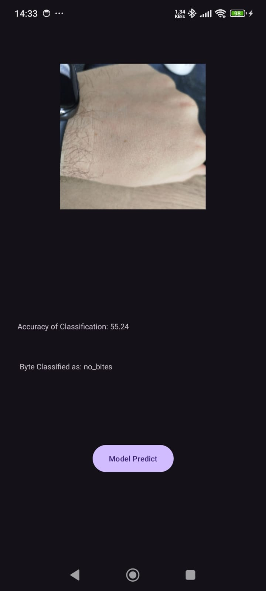

# android-insect-identification
Identify what type of insect byte you have

Using a tensorflow model that was created in Android Studio.

## PLEASE NOTE: THAT THIS IS EDUCATIONAL PURPOSES ONLY. THE TENSORFLOW MODEL USED IS STILL INACCURATE!!

